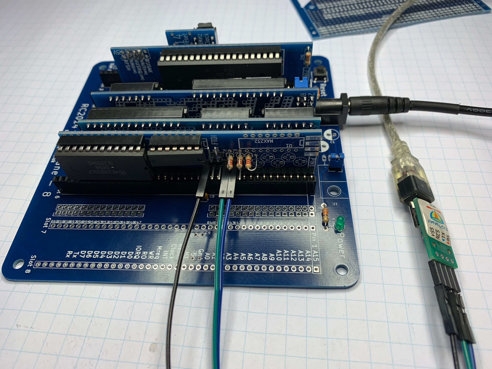
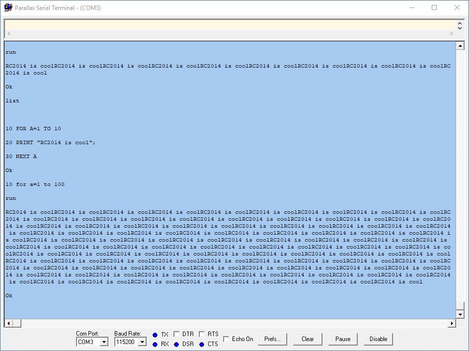

# Retro Fun with the RC2014

Links:

https://www.tindie.com/products/Semachthemonkey/rc2014-classic-homebrew-z80-computer-kit/

http://rc2014.co.uk/wp-content/uploads/2016/07/Full-Monty-Assembly-Guide.pdf

The board Gary bought:

http://cpuville.com/Kits/Single-board-instructions.pdf

An existing AY38910 board:

https://github.com/electrified/rc2014-ym2149/blob/master/rc2014-ym2149-schematic.pdf

# My Own Tools

My goal is to use only my own software tools: assembler and Z80 code. I have a COTs EEPROM programmer I'll use.

## Serial I/O

Step 1: Get the basic 6850 code to send/receive serial.

## IMPORTANT

The Z80 requires you to press reset after powerup. Some boards have circuitry to reset after power on. The RC2014
does not.

PRESS THE RESET BUTTON TO RUN CODE
