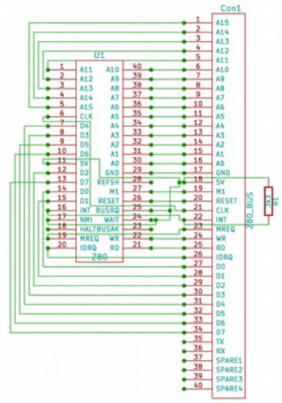
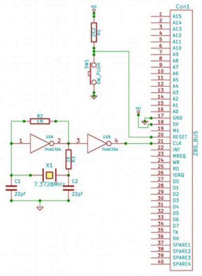
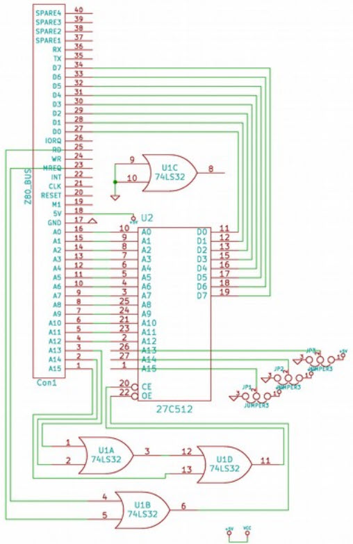
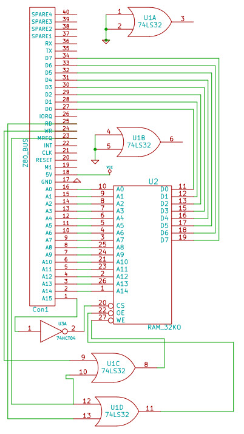
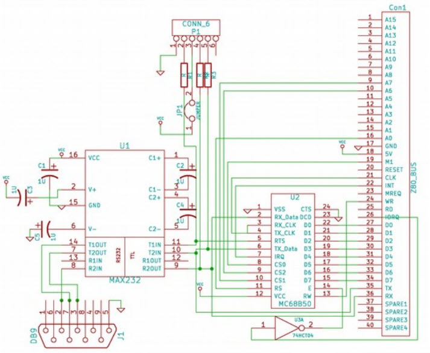
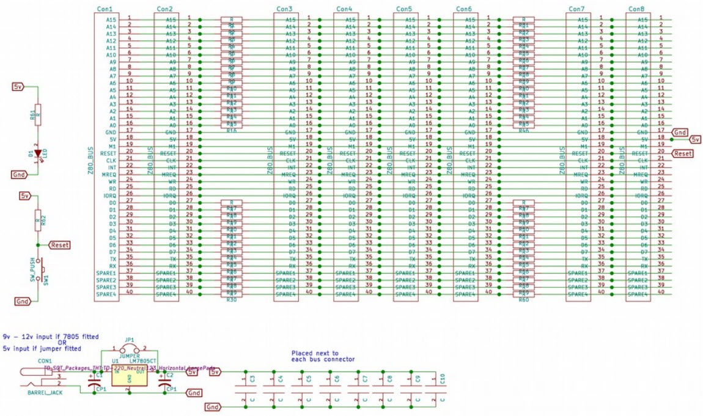

# RC2014 Schematics

These images are snagged from the official RC2014 site. I gathered them here for my quick access.

[https://rc2014.co.uk/](https://rc2014.co.uk/)

## Memory Map
  - 0000 - 1FFF ROM
  - 8000 - FFFF RAM
  
## Port Map
  - 80 - Serial Control/Status (ghosts 80-BF even)
  - 81 - Serial Tx/Rx (ghosts 80-BF odd)

## CPU

## Clock

## ROM

27C512 64K ROM mapped as 8 8K banks. Manual jumpers on ROM A15, A14, A13.

ROM is selected when upper 3 address pins of Z80 are 0's: 0000 - 1FFF

The RAM selects when upper pin is 1. It would have been better to select ROM when upper pin is 0
thus giving 32K ROM. All the I/O devices are mapped to ports. Other types of memory devices
that could appear here? Maybe screen memory?

## RAM

32K RAM chip.

RAM is selected when upper address pin of Z80 is 1: 8000 - FFFF

## Serial

MC68B50 chip mapped to PORT bus. Wired with +CS0 to M1, +CS1 to A7, -CS2 to A6. The RS is
mapped to A0.

Chip is selected when A7,A6 = 10: 0080 - 00B0. Even address have RS=0 = Control/Status. Odd
addresses have RS=1 = Tx/Rx.

The Z80 clock is 7,372,800Hz. Divide that by 64 ... perfect 115200 for the serial.

## Motherboard

